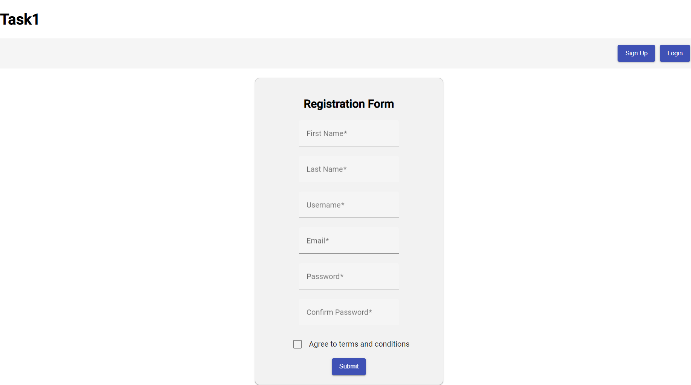
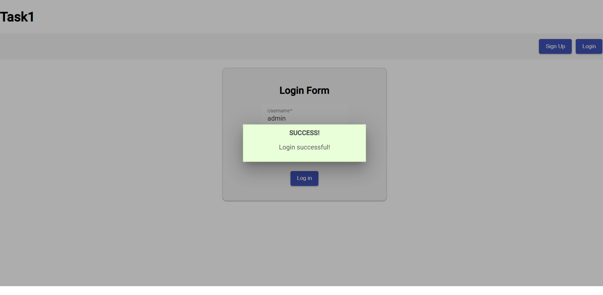

# Angular Registration and Login App

This is a simple Angular application implementing a user registration and login system. It uses Angular Material components for the user interface.

## Features

- User Registration: Allows users to create a new account with their personal information.
  
  
- User Login: Provides a login form for existing users to log in.
  
  
- Custom Validators: Implements custom Angular validators for password matching and terms acceptance.
  
  
  
- Server Backend: Includes a simple Express.js server to handle user registration and login.
  

## Getting Started
  
Follow these steps to get the application up and running:

  1. Clone the repository. (git clone https://github.com/PetraHajdu/Task1.git)
  2. Install dependencies and start the Angular development server (ng serve). The application will be accessible at http://localhost:4200/.
  3. Start the Express.js server for backend functionalities (node server.js). The server will run on http://localhost:3000/.

## Dependencies

- Angular: v12.x
- Angular Material: v12.x
- Express.js: v4.x
- Other dependencies (check package.json)
  

